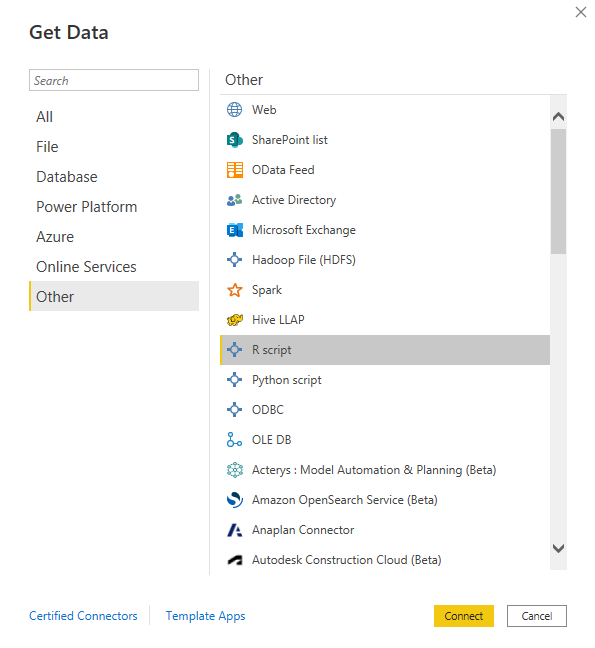

# Projeto Data Warehouse (BI) - projeto_dw

**`PUC Minas`** `[Disciplina: Business Intelligence]`

Este projeto visa o desenvolvimento de pipelines de extração, transformação e carga em Data Warehouse e o desenvolvimento de dashboards. O tema escolhido foi **Mobilidade Urbana** de Belo Horizonte, com enfoque em dados sobre **Acidentes de Trânsito** ocorridos nos perímetros da cidade.

-   [github.com/djmop/projeto_dw](https://github.com/djmop/projeto_dw)

## Contribuidores

1.  Daniel Nunes
2.  João Dias
3.  Maycon Felipe
4.  Octávio Martins
5.  Pedro Damasceno

## Conjuntos de dados

Para o desenvolvimento do Data Warehouse, foram utilizados quatro (4) conjuntos de dados sobre acidentes de trânsito em Belo Horizonte, tendo sido adquiridos no [Portal Brasileiro de Dados Abertos](https://dados.gov.br/). No momento desta redação, os dados compreendem o período de 2011 a 2021. Seguem os conjuntos:

1.  **Relação das pessoas envolvidas nos acidentes de trânsito com vítima** ([link](https://dados.gov.br/dataset/relacao-das-pessoas-envolvidas-nos-acidentes-de-transito-com-vitima))
2.  **Relação dos logradouros dos locais de acidentes de trânsito com vítima** ([link](https://dados.gov.br/dataset/relacao-dos-logradouros-dos-locais-de-acidentes-de-transito-com-vitima))
3.  **Relação dos veículos envolvidos nos acidentes de trânsito com vítima** ([link](https://dados.gov.br/dataset/relacao-dos-veiculos-envolvidos-nos-acidentes-de-transito-com-vitima))
4.  **Relação de ocorrências de acidentes de trânsito com vítima** ([link](https://dados.gov.br/dataset/relacao-de-ocorrencias-de-acidentes-de-transito-com-vitima))

## Data Warehouse

Os scripts de R contidos neste repositório realizam o download, extração e transformação dos dados. Na transformação, os dados são organizados em um *star-schema*, contemplado pelas seguintes tabelas fato:

1.  **Fato: Logradouros Envolvidos**
2.  **Fato: Veículos Envolvidos**
3.  **Fato: Pessoas Envolvidas**
4.  **Fato/Dimensão: Ocorrências**

### Diagrama Entidade Relacionamento (DER)


## Instalação

### Configuração do projeto em R e RStudio

1.  Instale base da [linguagem R](https://cran.r-project.org/bin/windows/base/) baixando-a do repositório CRAN. Recomenda-se a instalação direta em `C:/`. A versão utilizada neste projeto é a `R-4.2.1`.

2.  Realize o download da IDE [RStudio](https://www.rstudio.com/products/rstudio/download/#download) para configuração do projeto. Também recomenda-se a instalação direta em `C:/`.

3.  Clone o repositório do projeto

``` bash
git clone https://github.com/djmop/projeto_dw.git
```

4.  Abra o projeto a partir do arquivo `projeto.dw.Rproj` situado na pasta raiz do projeto.

5.  Instale o pacote [`{renv}`](https://rstudio.github.io/renv/articles/renv.html) via console do R e configure o ambiente do projeto.

``` r
# Instala {renv}
install.packages('renv')

# Configuração do ambiente
renv::restore()
```

<br /><br />

### Carregando dados no Power BI

1.  Instale o [**Microsoft Power BI**](https://powerbi.microsoft.com/pt-br/desktop/).

2.  Abra o **Power BI** e conecte a importação de dados via **R Script**.

<figure>



<figcaption aria-hidden="true">

<em>Selecione <strong>R script</strong> na importação de dados do <strong>Power BI</strong></em>

</figcaption>

</figure>

<br /><br />

3.  Insira o seguinte script no modal R script, alterando `<PATH_TO_PROJECT>` com o caminho do projeto em sua máquina. Clique em `OK` e aguarde o processamento. O log de processamento pode ser acompanhado a partir do arquivo situado em `log/global.log`.

``` r
# Parameters
project_root = '<PATH_TO_PROJECT>/projeto.dw/'

# Load main script
rscript = base::file.path(project_root, 'src/main.R')
source(rscript, encoding = 'UTF-8')

# Run
run_etl(project_root, download = TRUE, log = TRUE)
```

#### Exemplo:

<figure>


<figcaption aria-hidden="true">

<em>Insira o script no campo disponibilizado pela conexão <strong>R script</strong></em>

</figcaption>

</figure>
